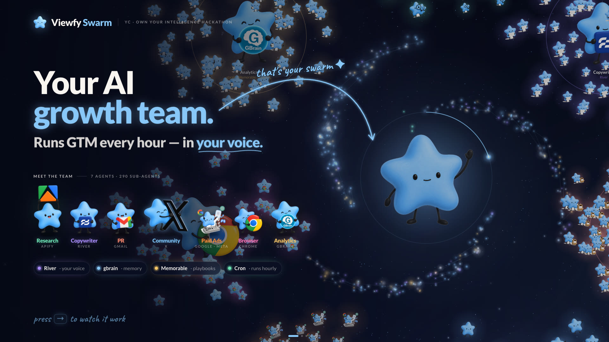
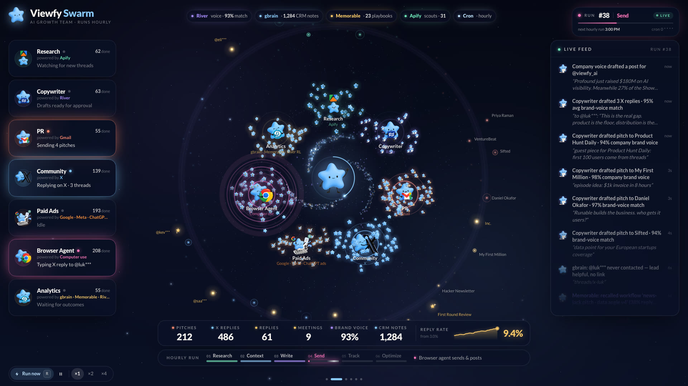
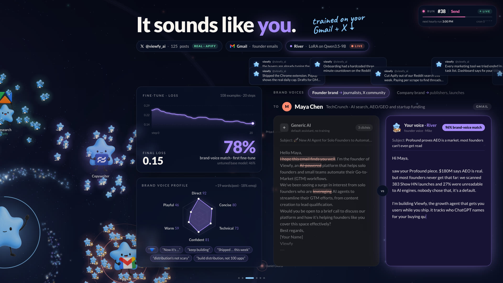
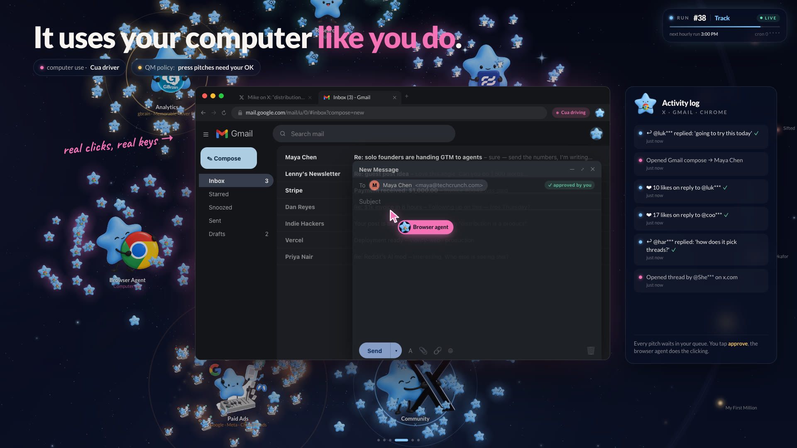
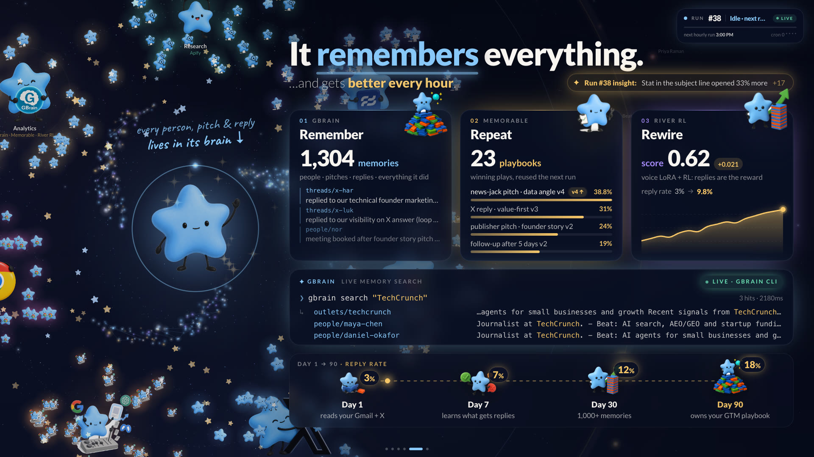
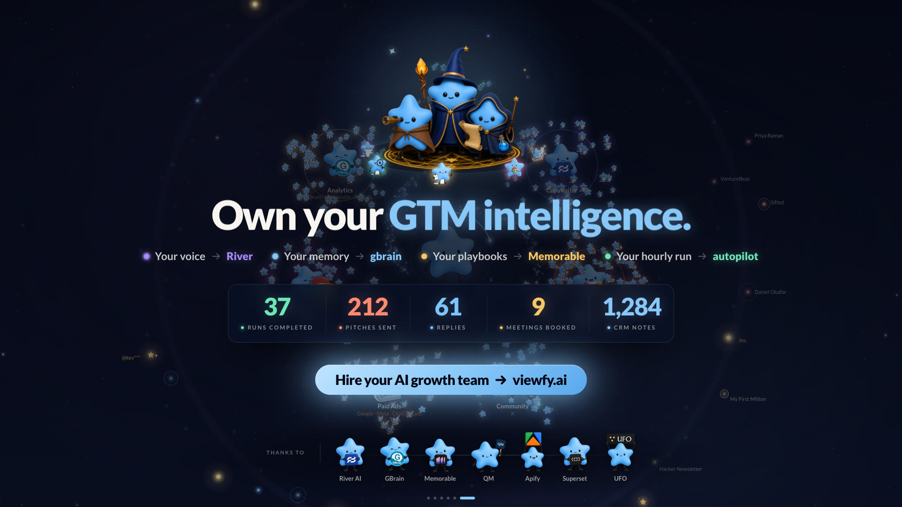
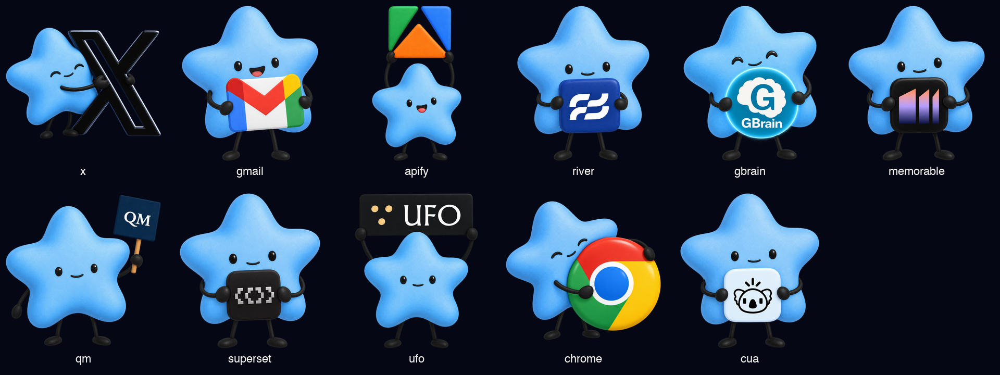
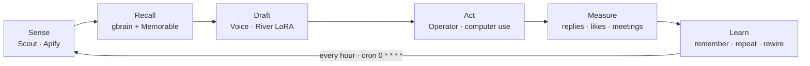

# Viewfy Swarm 🌟

> **Your AI sales floor.** It runs go-to-market every hour, in your voice, and gets smarter every loop.

Built at the YC **Own Your Intelligence** hackathon (River AI · GBrain · Memorable · QM · Superset · UFO), Sep 27 2026.
Everything runs locally. Nothing is deployed. Some parts are mocked, and the [real vs mocked](#sponsor-map--real-vs-mocked) table says which.

---

## Screenshots

| | |
|---|---|
|  |  |
| **1 · Hero:** your AI growth team | **2 · The team:** 7 agents running the hourly run live |
|  |  |
| **3 · Voice:** River LoRA trained on @viewfy_ai, generic AI vs your voice | **4 · Execution:** the browser agent drives X and Gmail |
|  |  |
| **5 · Memory:** live gbrain search, playbooks, fine-tuning | **6 · Close:** own your GTM intelligence |

Logo mascots (fal · gpt-image-2.5 edit of the Viewfy star plus each real logo):



## The idea

Early-stage founders do GTM at 2am. Generic AI sounds generic. Agents forget what they did yesterday.

**Viewfy Swarm** is a swarm of GTM agents working like a sales floor. Every hour it runs a loop:

1. Finds journalists, publishers and X conversations where founders ask for help.
2. Drafts in the **founder's own voice** (for journalists and the X community) or the **company voice** (for publishers).
3. Acts through computer use.
4. Measures what landed.
5. **Learns.**

**Own your GTM intelligence:** your voice lives in River weights, your memory in gbrain, your playbooks in Memorable, and your harness in QM.

## The hourly loop



Self-improvement happens in three layers:

| Layer | Tool | What it learns |
|---|---|---|
| **Remember** | gbrain | Facts: every person, pitch and reply, and everything the swarm did |
| **Repeat** | Memorable | Procedures: winning workflows get recalled in the next loop |
| **Rewire** | River | Weights: a voice LoRA, plus reinforcement learning with replies as the reward |

## The floor (agents)

| Agent | Job | Powered by |
|---|---|---|
| **Scout** | Finds news hooks, journalists, publishers, and X threads where founders ask for GTM help | Apify |
| **Voice** | Writes everything: founder voice for journalists and the X community, company voice for publishers | River (LoRA on Gmail + [@viewfy_ai](https://x.com/viewfy_ai)) |
| **Press desk** | Pitches journalists and publishers | Gmail (sending is mocked) |
| **Community** | Replies to and posts on X | X (posting is mocked) |
| **Operator** | The hands: drives X and Gmail like a human would | Computer use (Cua), animated on screen |
| **Coach** | Scores outcomes and writes down what was learned | gbrain · Memorable · River RL |
| **Brain** (center) | Long-term memory, plus GTM skills that run on cron | gbrain |

## Sponsor map: real vs mocked

| Sponsor | Role in the swarm | Demo status |
|---|---|---|
| **River AI** | Voice fine-tune (LoRA) + RL with replies as the reward | **Real**: LoRA rank 16 on Qwen3.5-9B, 20 steps on 108 examples (@viewfy_ai posts + 6 synthetic emails). Voice score 78% vs 46% for the untuned base. 10 of the X replies are raw model output; the emails were hand-edited because the model made up facts. |
| **GBrain** | Memory, plus skills (markdown workflows run on cron) | **Real CLI** (v0.59, PGLite, keyless). The brain is at `data/brain`, and the live search is in the Memory scene. Falls back to an in-memory store. |
| **Memorable** | Procedural memory of winning workflows | Mocked |
| **QM** | Multiplayer harness: room `#gtm-floor`, hourly cron | Mocked. Skills are written in QM/gbrain format. |
| **Apify** | Scout data: @viewfy_ai tweets (voice corpus), news hooks, founder threads on X | **Real**: 125 @viewfy_ai posts, 11 news articles from 2026, 15 founder posts on X (handles masked). Cached to `web/public/data`. Journalist names are fictional; their outlets are real. |
| **Computer use** | The Operator's hands | Mocked animation. It never posts. |
| **UFO / Superset** | Business agent OS / parallel coding agents | Credits only |

## The demo: a frontend instead of slides

The demo is one cinematic app. A night-sky swarm keeps running underneath every scene, and the arrow keys move a camera from one scene to the next:

1. **Hero:** the Viewfy star with the line *"Your AI sales floor."*
2. **The floor:** the camera zooms out to the full swarm running a loop live. You see the agent teams, particles flying out to journalists and X users, a stats bar and a live activity feed.
3. **Voice:** a model trained on Gmail + @viewfy_ai, its tone fingerprint, and **generic AI vs your voice** side by side.
4. **Hands:** computer use typing an X reply and a Gmail pitch.
5. **Memory:** the gbrain star cluster grows. Also a live `gbrain search`, the Memorable workflows, the River reward curve, and the mascot from Day 1 to Day 90.
6. **Close:** *"Own your GTM intelligence."* and viewfy.ai.

Keys: `→` / `space` next · `←` back · `R` run a loop now · `F` free-roam floor · `1`–`6` jump to a scene.

**Visual concept:** the Viewfy mascot is a star, so the swarm is a night sky.
- The star sits at the center, surrounded by a growing cluster of memories.
- Each agent team is a small cluster of stars around it.
- Hundreds of small agents stream out to an outer ring of journalists, publishers and X users.
- Pitches fly out as shooting stars, and replies come back gold.

## Stack

- **Bun + Vite + React 19 + TypeScript + Tailwind v4 + Motion**
- **Custom Canvas 2D swarm renderer:** additive glow, trails, about 2k particles at 60fps
- **Engine:** a seeded, deterministic scenario engine in plain TypeScript. It runs in the browser too, so the demo keeps going if the server dies.
- **Scheduling:** a real hourly cron on the server, plus a demo speed where 1h ≈ 30s
- **Server (`Bun.serve`):**
  - `/api/status`
  - `/api/learn`, which calls `gbrain remember`
  - `/api/brain/search`, which calls `gbrain search`
- **Data:** `web/public/data/*.json`, with the formats defined in `web/src/data/types.ts`. No database.
- **Brand:** the viewfy.ai mascot and palette (cream `#F8F5F1`, star blue `#88C8F8`, ink `#181717`), set in Lato + Caveat

## Layout

```
web/            Vite app: scenes, swarm canvas, loop engine
  public/brand/ viewfy.ai mascot + logo
  public/data/  fixtures (Apify data, River outputs)
server/         Bun API + hourly cron + gbrain adapter
river/          River voice fine-tune (LoRA + RL reward)
skills/         GTM skills in gbrain/QM markdown-workflow format
scripts/        Apify fetchers
```

## Build plan (2 hours)

| Time | Work | Owner |
|---|---|---|
| 0:00–0:10 | Project skeleton, brand colors, fonts | Claude |
| 0:10–0:55 | Swarm canvas + loop engine + on-screen stats (the part everything else depends on) | Claude |
| 0:10–0:45 | Apify → voice corpus + targets; River fine-tune + drafts | background agent `voice` |
| 0:10–0:45 | gbrain install + seed data + adapter; GTM skills | background agent `brain` |
| 0:55–1:20 | Scenes: Voice, Hands, Memory, Close | Claude |
| 1:20–1:40 | Wire in real data + live gbrain search + hourly cron | Claude |
| 1:40–2:00 | Polish, rehearse, record a backup screen video | team |

## Run

```bash
bun install
bun run dev   # web on http://localhost:5173 (open #hero), api on :8787
```

Keys: `→`/`space` next · `←` back · `1`–`6` jump · `R` run a loop now · `F` floor · **`P` autoplay the whole demo (~2.5 min, for hands-free recording)** · `C` hide cursor + nav dots.

Recording script with narration and timings: [DEMO.md](DEMO.md).

### Real integrations you can show

```bash
# gbrain: the swarm's memory (real CLI, local PGLite brain)
export GBRAIN_HOME=$PWD/data/brain
gbrain search "TechCrunch"
gbrain search "data angle"

# River: sample from the fine-tuned voice adapter (LoRA on Qwen3.5-9B, ~12s)
uv run --project river river/train_voice.py --sample

# API the UI uses
curl -s 'localhost:8787/api/brain/search?q=TechCrunch&limit=3'
curl -s localhost:8787/api/status
```

Rebuilding the brain on a new machine: `GBRAIN_HOME=$PWD/data/brain gbrain init --pglite --no-embedding --non-interactive && bun scripts/brain-seed.ts`
(gbrain is installed from a local clone at `../gbrain` via `bun link`, because `bun install -g github:garrytan/gbrain` currently fails).

## Environment

`.env` is gitignored and holds `APIFY_TOKEN`, `RIVER_API_KEY` and `X_HANDLE`.
